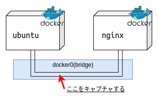
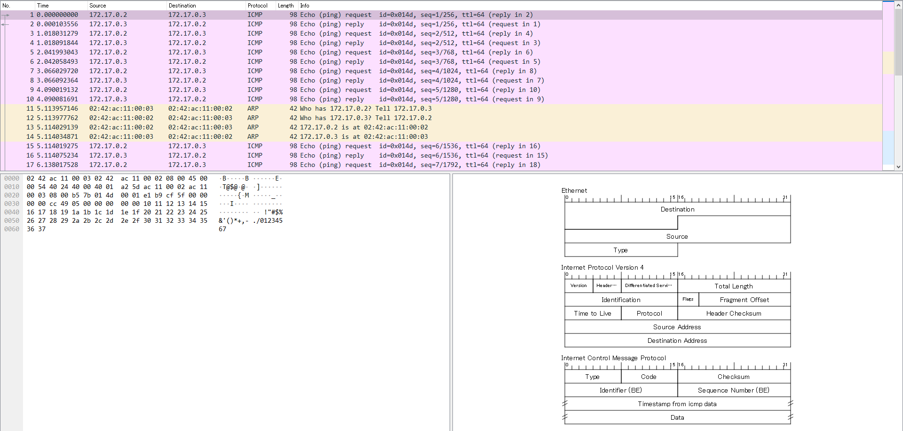
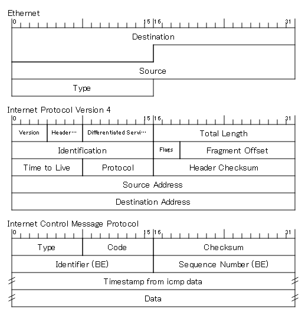

Docker コンテナ間のパケットの流れが知りたかったので実験をしてみました．

Part-1(この記事)でパケットキャプチャを，後半の Part-2 では実験後調べてわかったことをまとめています．

## 実験

Docker コンテナを２つ作り，その間を通るパケットをキャプチャします．



## 環境

- GNU/Linux Ubuntu20:04
- Docker version 20.10.0 build 7287ab3

## 1. Docker コンテナを２つ作成する

1. nginx のコンテナ
2. ubuntu20.04 のコンテナ

### イメージの取得

```bash=
docker pull ubuntu:focal
docker pull nginx:stable
```

イメージが取得できたか確認します．

```bash=
docker images
```

```
REPOSITORY          TAG                 IMAGE ID            CREATED             SIZE
ubuntu              focal               f643c72bc252        12 days ago         72.9MB
nginx               stable              2562b6bef976        13 days ago         133MB
```

### コンテナ作成

```bash=
docker run -dit --name ubuntu ubuntu:focal
docker run -d --name nginx -p 8080:80 nginx:stable
```

コンテナが作成できたか確認します．

```bash=
docker container ps -a
```

```
CONTAINER ID   IMAGE                       COMMAND                  CREATED          STATUS                    PORTS                  NAMES
d548a1da6a21   ubuntu:focal                "/bin/bash"              10 minutes ago   Up 10 minutes                                    ubuntu
04fc8579cf2d   nginx:stable                "/docker-entrypoint.…"   13 minutes ago   Up 12 minutes             0.0.0.0:8080->80/tcp   nginx
```

## 2. コンテナ間で疎通

### ping を飛ばせるようにする

Ubuntu のコンテナに必要なパッケージのインストールを行います．

`ping` コマンドを使いたいので `iputils-ping` パッケージをインストールします．

```bash=
docker exec -t ubuntu apt update
docker exec -t ubuntu apt install -y iputils-ping
```

`ping` が飛ばせるか確認します．

```bash=
docker exec -it ubuntu ping 8.8.8.8
```

```
PING 8.8.8.8 (8.8.8.8) 56(84) bytes of data.
64 bytes from 8.8.8.8: icmp_seq=1 ttl=113 time=4.19 ms
64 bytes from 8.8.8.8: icmp_seq=2 ttl=113 time=4.54 ms
64 bytes from 8.8.8.8: icmp_seq=3 ttl=113 time=4.05 ms
64 bytes from 8.8.8.8: icmp_seq=4 ttl=113 time=4.05 ms
64 bytes from 8.8.8.8: icmp_seq=5 ttl=113 time=3.92 ms
^C
--- 8.8.8.8 ping statistics ---
5 packets transmitted, 5 received, 0% packet loss, time 4006ms
rtt min/avg/max/mdev = 3.923/4.150/4.538/0.210 ms
```

### コンテナの ip アドレスを確認する

IP アドレスは `hostname` コマンドでわかります．

```bash=
docker exec nginx hostname -i
```

```
172.17.0.2
```

２つのコンテナの IP アドレスは表の通り．

| コンテナ | IP アドレス |
| -------- | ----------- |
| ubuntu   | 172.17.0.2  |
| nginx    | 172.17.0.3  |

### 疎通確認

Ubuntu コンテナ側から `ping` を飛ばしてみます．

```bash=
docker exec -it ubuntu ping 172.17.0.3
```

```
PING 172.17.0.3 (172.17.0.3) 56(84) bytes of data.
64 bytes from 172.17.0.3: icmp_seq=1 ttl=64 time=0.015 ms
64 bytes from 172.17.0.3: icmp_seq=2 ttl=64 time=0.049 ms
64 bytes from 172.17.0.3: icmp_seq=3 ttl=64 time=0.044 ms
64 bytes from 172.17.0.3: icmp_seq=4 ttl=64 time=0.049 ms
64 bytes from 172.17.0.3: icmp_seq=5 ttl=64 time=0.054 ms
^C
--- 172.17.0.3 ping statistics ---
5 packets transmitted, 5 received, 0% packet loss, time 4100ms
rtt min/avg/max/mdev = 0.015/0.042/0.054/0.013 ms
```

## 3. パケットキャプチャ

Wireshark を開き，インターフェースに `docker0` を選択してパケットキャプチャを行います．



## 4. わかったこと

Wireshark のスクリーンショットの右下にパケットの構造が表示されています．Ethernet の中に IPv4 があり，そのデータ部分に ICMP があります．



ここからわかるのは流れているのは普通のパケットと同じ構造のものということです．

---

Part-2 に続きます．

次：Part-2(今月中に投稿する予定)
