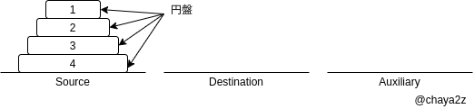
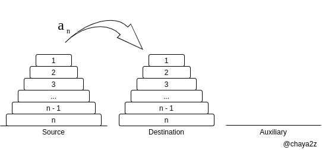
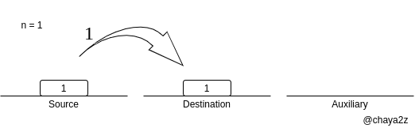
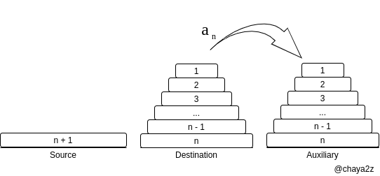
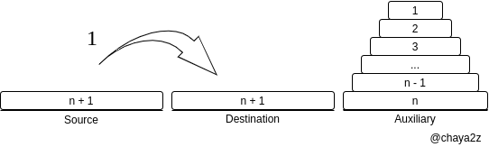
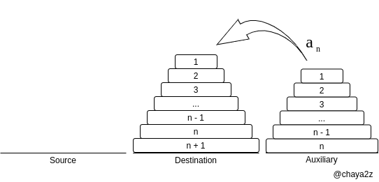
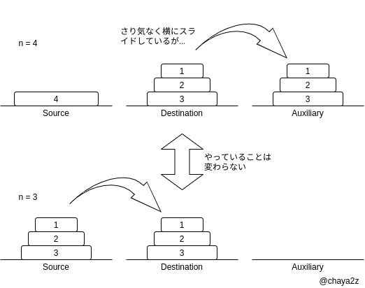

『入門 データ構造とアルゴリズム』の2章「再帰と後戻り」についている問題をPythonで書いてみました．間違いを見つけた場合お手数ですが私のツイッターかGitHubに連絡をください．
<br>
- [Twitter](https://twitter.com/chaya2z)
- [GitHub](https://github.com/chaya2z/DataStructuresAndAlgorithms/tree/master/2_recursive_and_backtracking)

## 再帰の問題

### 問題2-1 ハノイの塔を論ぜよ

Pythonでハノイの塔の最小移動回数の手順を求めるプログラムを書いてみます．コード自体は短いですが，理解するのが難しかったので順を追って説明します．<br>
[ハノイの塔とは（Wikipedia）](https://ja.wikipedia.org/wiki/%E3%83%8F%E3%83%8E%E3%82%A4%E3%81%AE%E5%A1%94) <br>
この記事では本に従って以下のように用語を使います．<br>



### 最小移動回数を求める

ハノイの塔の解説を読むと「n番目の円盤をSourceからDestinationに移す．」「n-1枚の円盤を，AuxiliaryからDestinationに移す．」という説明が出てきます．しかしどういうきっかけでそれを思いつけばいいのかわからなかったので書きます．<br>
漸化式を使って最小移動回数を求めます．<br>
まず円盤の枚数が1枚，2枚，3枚... n-1枚，n枚のときの最小移動回数からなる数列を数列\\( \lbrace a_n \rbrace\\)とします．初項\\(a_1\\)は1枚の円盤をDestinationに移すだけなので\\(a_1 = 1\\)となります．<br>
以下の図のようにn段円盤があるときその最小移動回数は　\\( a_n = n \\) 回です．



円盤が1枚のときは最小移動回数は \\( a_1 = 1 \\) 回です．



次に \\(a_{n + 1}\\) の時を考えます．
<br>
- n段の円盤をAuxiliaryに移動する．
- n + 1枚目をDestinationに移動する．
- Auxiliaryに移動したn段の円盤をn + 1の上に載せるようにDestinationに移動する．
- n + 1の山が完成する．

<br>つまり \\( a_{n + 1} = a_n + 1 + a_n = 2a_n + 1 \\) となります．<br>
これを図で表すと以下のようになります．<br>
まずn段をAuxiliaryへ移動する最小移動回数は \\( a_n \\) です．



次にn + 1段を移動する最小移動回数は1です．



最後にn段をDestinationへ移動する最小移動回数は \( a_n \) です．<br>




これが \\( a_{n + 1} = a_n + 1 + a_n = 2a_n + 1 \\) の意味です．<br>
\\( a_{n + 1} = 2a_n + 1 \\) を変形すると
\\( a_{n + 1} - 1 = 2(a_n + 1) \\) <br>
ここで， \\( a_n + 1 = b_n \\) とおくと
\\( b_{n + 1} = 2b_n，b_1 = a_1 + 1 = 1 + 1 = 2 \\) <br>
よって数列 \\( \lbrace b_n \rbrace \\) は初項2，公比2の等比数列であるから
\\( b_n = 2 \bullet 2^{n-1} = 2^n \\) <br>
したがって \\( a_n = b_n - 1 = 2^n - 1 \\) <br>
というわけで円盤n枚のときのハノイの塔の最小移動回数は \\( 2^n - 1 \\) とわかりました．<br>
その過程でn枚目の円盤とn-1枚の円盤に分ける考え方が理解できたと思います．

### なぜ再帰関数か

なぜ再帰関数で求めることができるのかを考えます．繰り返されている処理と入れ子になっている処理を見つけます．

#### 繰り返されている部分

私は以下の図のイメージで繰り返されている部分に気づきました．再帰に気づくヒントになると思います．この図ではn = 4の場合までしか載っていませんがそれ以上の場合も変わりません．


<br>繰り返されているのは以下の処理です．
<br>
- n - 1段を真ん中に作る．
- n - 1段をAuxiliaryに移動する．
- n段目をDestinationに移動する．
- n - 1段をAuxiliaryからDestinationに移動する．

<br>これは何段であっても同じです．<br>
次に上の図では省略されているn - 1段をDestinationからAuxiliaryに移動する部分を考えてみます．例えばn = 4のときDestinationに積まれた3段の円盤をAuxiliaryにスライドしています．ここはn = 3のときにSourceからDestinationに移動するのと使う場所が違うだけでやることは変わりません．ただ移動元と移動先が変わるだけです．<br>



では，そもそもn = 1段をSourceからDestinationに移動するにはどうすればいいでしょうか．上のGIF画像を見ながら考えてみてください．
n = 2で作れる円盤を利用してn = 3を作っています．そしてn = 2を作るのにn = 1を利用しています．<br>
n段を移動するのにn - 1段を利用し，n - 1段を作るのにn - 2段を利用し，n - 2段を作るのにn - 3を \\( \cdots \\) と入れ子になっているのです．

### 手順を求める

それではどのような手順で円盤を操作すれば最小移動回数でハノイの塔の目標を達成できるか，再帰関数を使ってコードを書いていきます．<br>
まず1段目（一番上）を移動します．1段目を利用して2段の山をDestinationに作ることができます．そして同じように3段目を作ることができ \\( \cdots \\) n段目が完成します．
<br>

```
def towers_of_Hanoi(n, frompeg, topeg, auxpeg):
    # First, move disk 1.
    if n == 1:
        print("Move disk 1 from peg", frompeg, "to peg", topeg)
        return

    # move n - 1 pegs from source to auxiliary.
    towers_of_Hanoi(n - 1, frompeg, auxpeg, topeg)

    print("Move disk", n, "from peg", frompeg, "to peg", topeg)

    # move n - 1 pegs from auxiliary to destination
    towers_of_Hanoi(n - 1, auxpeg, topeg, frompeg)


towers_of_Hanoi(3, "A", "B", "C")

```


## 後戻りの問題

### 問題2-2 nビットのすべての列を生成せよ．A[0..n-1]をサイズがnの配列と仮定せよ．

たとえばn = 2なら00，01，10，11を出力するということです．やり方はいろいろありますがここでは本に載っているやり方と同じような考え方でやります．

コードを追うと0と1で分岐する図が想像できると思います．
<br>

```
bit: int = int(input())

A = [0] * bit


def binary(n):
    if n < 1:
        print(A)
    else:
        A[n - 1] = 0
        binary(n - 1)
        A[n - 1] = 1
        binary(n - 1)


binary(bit)

```

### 問題2-3 0..k-1を要素とする長さnの列をすべて生成せよ．

問題2-2では2進数の場合を考えましたが今度はk進数の場合を考えます．こちらも本に載っているやり方と同じような考え方でやります．
<br>
```
digit, nary = map(int, input().split())

A = [0] * digit


def k_string(n, k):
    if n < 1:
        print(A)
    else:
        for i in range(k):
            A[n - 1] = i
            k_string(n - 1, k)


k_string(digit, nary)

```

<br>たとえば3桁のk進数と言われれば3重にfor文でループを回せばすべての列を生成できます．しかし今回のような列の長さがわからない場合に再帰がうまく使えます．

## おわりに

ハノイの塔が難しかったです．階乗を再帰で計算するのとはやっていることが全然違うものに思えて理解するのに時間がかかりました．再帰は遅くて実際のコード中ではほとんど使われない（大抵が反復を使う）イメージがあるので，解きながら問題の難易度と実用性が見合わないのではないかと感じていました．本によると再帰の問題が後のページで出てくるようなので今回の勉強が役に立つといいです．

## 本の紹介

今回使用したのはオライリージャパンから発行されている『入門データ構造とアルゴリズム』（Narasimha Karumanchi 著 黒川 利明・木下 哲也 訳）です．


