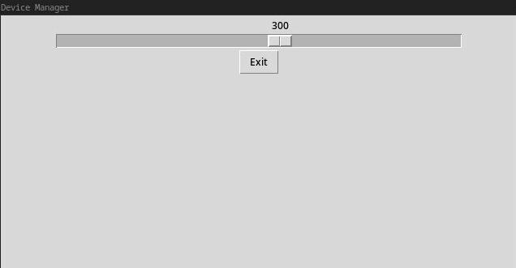

PythonのTkinterを使い，ラップトップの画面の明るさを変えるだけのGUIアプリを作りました．

ソースコードは[こちら](https://github.com/chaya2z/DeviceManager)．

## 外観

アプリのスクリーンショットです．

## 目的

私はウィンドウマネージャのi3を使っており，GNOMEやKDEといったデスクトップ環境は入れていません．それらのデスクトップ環境にあるような画面の明るさや音量を変える設定アプリは無いため，自分で作ることにしました．すでに他の人が作ったものはありますが，勉強のため画面の明るさを変えるアプリを作ることにしました．

## おわりに

polybarから呼び出せるようにして使っていく予定です．rofiとは別によく使う項目をここに機能追加していく予定.
