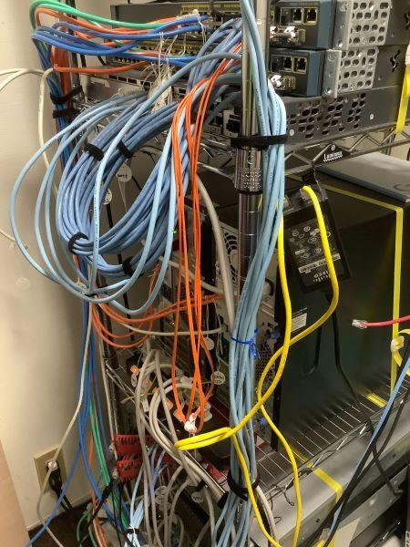
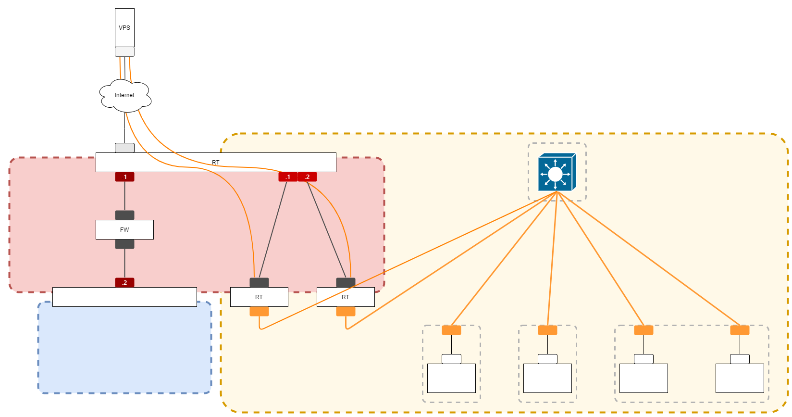
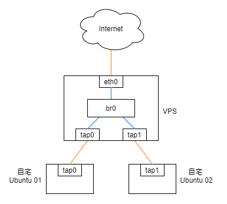

この記事は [ITRC Advent Calendar 2021](https://adventar.org/calendars/6368) の1日目の記事です．

私の自宅ネットワークインフラの紹介をします．いままで大したことをしてなかったので外部に公開するのは憚られていたのですが，少しは以前よりマシになったと思いたいです．



## トポロジ図



この画像の右側の黄色い部分 ( DMZ ) の話をします．

## ネットワーク

私の自宅には IPv6 のグローバルアドレスが提供されていません．そこで IPv6 の提供される VPS を契約して VPN を繋ぎ，オーバーレイネットワークを作ることで自宅にそれらのアドレスを割り当てました．契約したのは ConoHa VPS で， ConoHa VPS では１つの NIC につき 17個の IPv6 グローバルアドレスがもらえます．


こんな感じで固定の IPv6 アドレスが貰えます．プレフィックスは `/64` です．

### VPN

VPN は Ubuntu に入れた OpenVPN を使っています．OpenVPN は他の VPN プロトコルと比べると ( 証明書を用いた方式の場合 ) 設定が複雑です．しかし以下の条件に当てはまるプロトコルだったので選択しました．

\- 両方のノードがグローバル IP アドレスを持っている必要がない

\- L2 レベルで接続できる


オーバーレイネットワークは次の図のようになります．



最初は VyOS を使って L2TPv3 over WireGuard なんてことをしていたのですが，オーバーヘッドが大きくレイテンシが高くなってしまったのでやめました．

その結果 自宅 - VPS 間の平均レイテンシが 40ms から 5ms になりました．

Before

```
rtt min/avg/max/mdev = 39.541/48.039/80.300/16.134 ms
```

After

```
rtt min/avg/max/mdev = 4.629/5.247/8.509/1.114 ms
```

まだ検証はしていませんが，40ms もかかっていたのは，

1.VyOS の処理が遅い

2.WireGuard が遅い

のどちらかが原因で，WireGuard がそんなに遅いとは思えないので VyOS が原因なんだろうなと思ってます．

### ルーティング

ルーティングでは設定の手間を省くためダイナミックルーティングを行っています．使っているプロトコルは BGP と OSPF です．これらのプロトコルの ECMP で負荷分散ができるところが好みです．BGP と OSPF の２種類のプロトコルを使っているのは BGP に対応していない機器 ( 具体的には Cisco の IP-Base のイメージの入った L3 スイッチ ) があるせいです．

## サーバ

サーバでは Kubernetes を中心に運用しています．Kubernetes は最近勉強し始めました．

## まとめ

これからもいろいろ遊んでいきたいです．他の人とネットワーク作るようなことをしていく予定です．