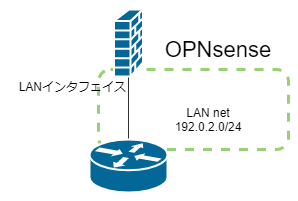
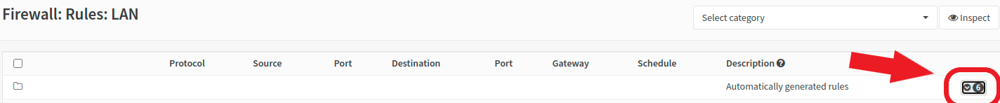
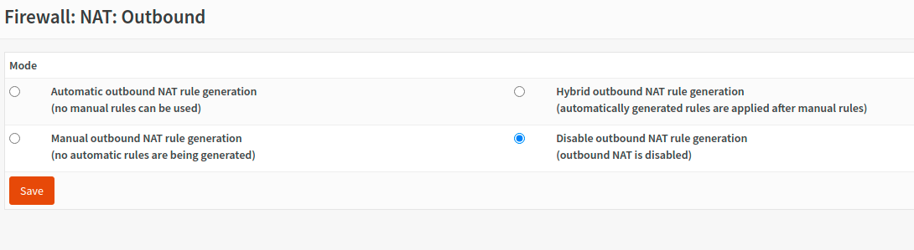

ところどころつまずいたので残す．

## LAN net という項目

例えばLANという名前のインターフェイスがあったとき，ファイアウォールのルールの Source や Destination の選択肢で「LAN address」や「LAN net」という項目が選べる．

このLAN netというのは**LANインターフェイスが所属するネットワークだけ**を指し，それより下のネットワークは見ない．\
図1の状況において，LAN net は 192.0.2.0/24 である．例えば送信先がLAN netのパケットを Reject する項目を追加しても，192.0.2.0/24 しかReject しない．



## 自動生成されるファイアウォールルールを確認する

自動生成されるルールはウェブページを開いたときに隠れているので表示して確認する．



## ファイアウォールルールの順番確認する

まずはドキュメントを参照するとよい．\
https://docs.opnsense.org/manual/firewall.html

ファイアウォールは次の順番で評価される．

1. Floating（全インタフェイス）での設定
2. グループでの設定
3. インターフェイスごとの設定

それぞれの項目の中では**表の上のものが優先されて評価される**．

## NATルールを確認する

恐らくデフォルトで有効になっている．

NATしない場合は「Disable outbound NAT rule generation」を選択する．



## WEB GUIに繋げなくなったとき

ファイアウォールの設定を消してしまい，WEB GUIへの接続がはじかれてしまったときの対処法を説明する（CLIが使えることが前提）．

`pfctl` コマンドを使ってCLIから pf の設定を行う．

```
pfctl -d
```

`-d` は disable のことで，ファイアウォールを無効にする．
これで WEB GUI に繋がるので設定を再開すればよい．

再び有効にするには WEB GUI で設定を適用するか，`pfctl` コマンドを使う．


```
pfctl -e
```

`-e` は enable のことで，ファイアウォールを有効にする．

## 同じネットワークのアドレスをインターフェイスに振ってはいけない

2つ以上のインターフェイスに同じネットワークのIPアドレスを振るとその設定が無効化され接続できなくなる．

同じネットワークに所属させたければ bridge 機能を使えばいいはず（未検証）．